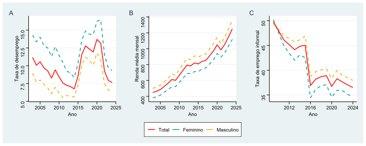
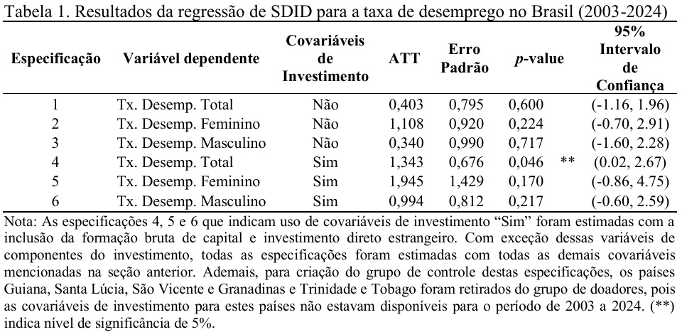
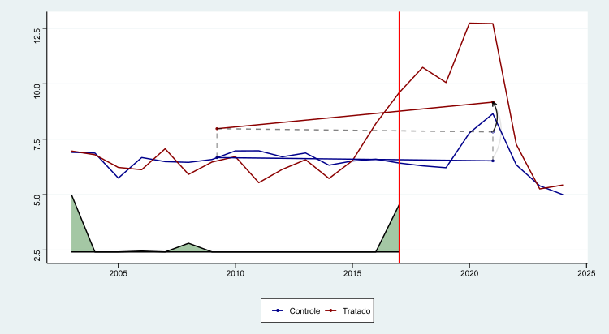
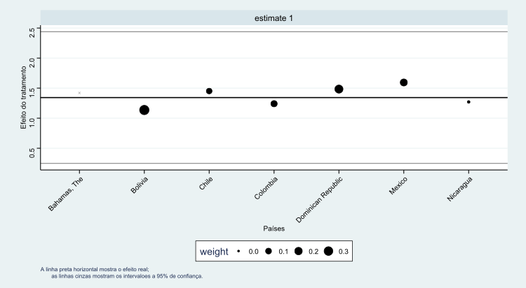
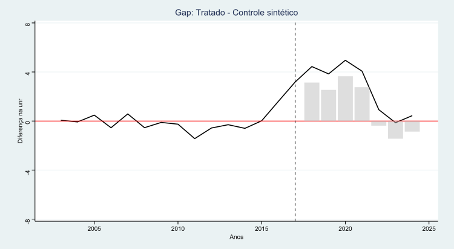
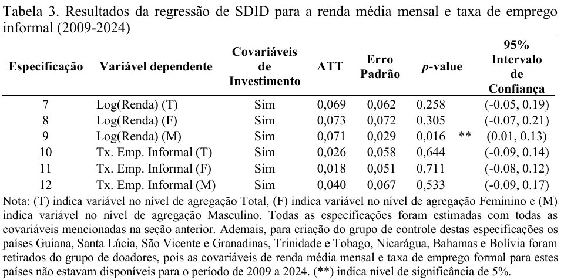

## Introdução e Objetivos

::: {.fragment .fade-in}
::: {.blackbox .font-small}

::: {style="display: flex; flex-direction: column; justify-content: center; align-items: center; text-align: center;"}



*Mercado de trabalho no final de 2025*

:::

- A taxa de desemprego **caiu para 5,1%** (5,5 milhões), o menor nível da série histórica da Pnad Contínua do IBGE;

- O nível de ocupação **subiu para 59,1%** (103 milhões);

- Redução da taxa de informalidade de 39% em 2024, **para 38,1% em 2025**;

- Remuneração média dos trabalhadores **cresceu 5%** em relação ao ano anterior, atingindo **R$ 3.613**.

- *A reforma trabalhista de 2017 contribuiu para estes resultados?*

:::

:::

::: {style="margin-bottom: 20px;"}
:::

::: {.fragment .fade-in}

:::: {.columns style="display: flex;"}

::: {.column width="50%" style="display: flex;"}
::: {.blackbox .font-small}
- Um relatório do **FMI** aponta as reformas realizadas como justificativa para as revisões positivas das estimativas de crescimento do PIB, entre elas a reforma trabalhista, que contribuiu para a **redução da litigância** e **insegurança jurídica**, o que por sua vez expandiu o **emprego formal** e **aumento da produtividade**. (Veloso, 2024)
:::
:::

::: {.column width="50%" style="display: flex;"}
::: {.blackbox .font-small}
- A reforma **falhou em cumprir seus objetivos** de gerar emprego e reduzir a informalidade. O cenário positivo no mercado de trabalho na verdade diz respeito ao resultado do **crescimento econômico** e de **políticas públicas de estímulo à demand**a. (Oliveira e Proni,2024)
:::
:::

::::

:::

## Introdução e Objetivos

- **Contexto:** A Reforma Trabalhista (Lei nº 13.467/2017) entra em vigor em novembro de 2017;

::: {.fragment .fade-in}

:::: {.columns style="display: flex;"}

::: {.column width="33.33%" style="display: flex;"}

::: {.blackbox .font-small}

::: {style="display: flex; flex-direction: column; justify-content: center; align-items: center; text-align: center;"}



*Modernização da CLT*

:::

Estabelecer a prevalência do **negociado** sobre o **legislado** e reduzir a insegurança jurídica e litigiosidade.
:::

:::

::: {.column width="33.33%" style="display: flex;"}

::: {.blackbox .font-small}

::: {style="display: flex; flex-direction: column; justify-content: center; align-items: center; text-align: center;"}



*Flexibilização do Mercado*

:::

Introduzir novos regimes como **trabalho intermitente**, **teletrabalho** e ampliação da **terceirização**.
:::

:::

::: {.column width="33.33%" style="display: flex;"}

::: {.blackbox .font-small}

::: {style="display: flex; flex-direction: column; justify-content: center; align-items: center; text-align: center;"}



*Combate à Crise*

:::

Aumentar a **produtividade**, gerar **novos empregos** e reduzir drasticamente a **informalidade**.
:::

:::

::::

:::

::: {style="margin-bottom: 20px;"}
:::

- **Objetivo Geral:** Avaliar o impacto da reforma sobre a taxa de desemprego;

-  **Objetivos Específicos:** Estimar impactos na renda média mensal de trabalhadores formais e no nível de informalidade, com recortes por gênero.

## A Determinação do Emprego e Reforma Trabalhista no Brasil

\

:::: {.columns style="display: flex;"}

::: {.column width="50%" style="display: flex;"}

::: {.blackbox .font-small}

::: {style="display: flex; flex-direction: column; justify-content: center; align-items: center; text-align: center;"}



*Paradigma Neoclássico (Oferta)*

:::

- *Diagnóstico:* O desemprego é causado pela rigidez dos salários e preços;

- *Solução:* **Flexibilização** dos salários, dos regimes de contratação e da jornada de trabalho podem aumentar o nível de emprego;

- *Influência:* Inspirado na teoria **Neoclássica** e em recomendações do **FMI**(2016).

:::

:::

::: {.column width="50%" style="display: flex;"}

::: {.blackbox .font-small}

::: {style="display: flex; flex-direction: column; justify-content: center; align-items: center; text-align: center;"}



*Paradigma Heterodoxo (Demanda)*

:::

- *Diagnóstico:* O desemprego é resultado da **falta de demanda efetiva**;

- *Solução:* **Políticas fiscais expansivas** e **investimento público** seriam os mecanismos corretos para gerar emprego;

- *Consequências:*  A flexibilidade salarial excessiva pode gerar **incerteza** e **reduzir o consumo**, agravando a crise em vez de resolvê-la.

:::

:::

::::

## Principais pontos de alteração na CLT 

\

::: {style="font-size: 0.8em;"}

| Eixo Temático | Descrição da  Mudança | 
| ------ | --------------------- | 
| **Negociação Coletiva**    | Art. 611-A: **Prevalência do acordado sobre o legislado**. | 
| **Jornada de Trabalho**    | Art. 59: **Estende banco de horas para acordos individuais**(compensação em 6 meses); **jornada 12x36** para todas as categorias; indenização apenas do tempo suprimido do intervalo (Art. 71).                                                                |
| **Remuneração**            | Art. 457: **Exclusão de abonos e prêmios da base salarial**, deixando de compor a remuneração para fins de encargos trabalhistas e previdenciários. Art. 461: Equiparação salarial restrita ao mesmo estabelecimento.| 
| **Regimes de Trabalho**    | Criação do trabalho **intermitente** (Art. 443), **terceirização** irrestrita, inclusive da atividade-fim. | 
| **Rescisão Contratual**    | Art. 484-A: **Rescisão por acordo mútuo**. **Fim da homologação sindical** obrigatória para contratos superiores a um ano. Artigo 477-A **equipara as demissões coletivas às individuais** |
| **Representação Sindical** | **Contribuição sindical facultativa**. Art. 620: Acordos por empresa prevalecem sobre convenções de categoria. Art. 510, limita a representação sindical no local de trabalho a empresas com 200+ empregados.|

:::

## Críticas à reforma trabalhista

- Carvalho (2017) e Campos (2017) vão destacar os seguintes pontos: 

- Elevação da condição das negociações individuais, a contribuição sindical facultativa e os acordos coletivos firmados no âmbito da empresa **fragilizam a atuação dos sindicatos** e acabam por **reduzir o poder de barganha** dos trabalhadores;

- A flexibilização excessiva e criação de contratos de trabalho atípicos **incentivam vínculos de curta duração**, desestimulando o **investimento em treinamento e qualificação** o que tende a **impactar negativamente a produtividade**;

- A limitação da representação sindical no local de trabalho à empresas com mais de 200 empregados, **limita o papel de resolução de conflitos** dos sindicatos e que dificilmente reduzirá a demanda por ações na JT;

- A reforma poderia levar a formalização de **postos de trabalho precários**, sem ganhos de qualidade;

- O fim da homologação sindical, poderia na verdade **aumentar a litigiosidade** resultando em insegurança jurídica;

## Revisão da literatura empírica

::: {style="font-size: 0.62em;"}

| Autor                               | Delimitação da Análise                                            | Metodologia                                                                        | Principais Resultados                                                                                                                                                        |
| ----------------------------------- | ---------------------------------------------------------------------------- | ---------------------------------------------------------------------------------- | ---------------------------------------------------------------------------------------------------------------------------------------------------------------------------- |
| **Ottoni e Barreira (2021)**        | Impacto de longo prazo no desemprego.                                        | Método de Controle Sintético (SCM)                                                 | Projeção de redução na taxa de desemprego entre -1,17 e -3,46 p.p. com maturação de 5 a 10 anos.                                                                             |
| **Serra, Bottega e Sanches (2022)** | Impacto no desemprego nos três primeiros anos (curto prazo).                 | Método de Controle Sintético (SCM)                                                 | Inexistência de efeitos estatisticamente significantes sobre o desemprego no período avaliado (2018-2020).                                                                   |
| **Santos, Silva e Aragón (2025)**   | Avaliação da meta primária (desemprego) e dinâmicas subjacentes.             | Modelo Dinâmico de Fator Latente Multinível (DM-LFM)                               | Efeito adverso: elevação média de 3 p.p. na taxa de desemprego entre 2018 e 2021.                                                                                            |
| **Kohli (2025)**                    | Impacto das contribuições sindicais facultativas na fiscalização e salários. | Diferenças em Diferenças Sintético (SDID)                                          | Enfraquecimento sindical: redução de 0,9% nos salários e queda de 2,5% no nível de emprego formal.                                                                           |
| **Azevedo (2021)**                  | Durabilidade do emprego e rotatividade laboral.                              | DiD e Modelos de Sobrevivência (Weibull) com dados da PNAD Contínua (2017-2018).   | Impacto positivo na duração dos contratos (Aumento médio de **48 dias**) e redução da probabilidade de saída do trabalhador (queda de 19% no risco de rescisão).             |
| **Oreiro et al. (2023)**            | Qualidade do emprego e estrutura ocupacional.                                | Aplicação do Índice de Qualidade do Emprego (EQI); análise de dados em painel para | Aumento da precariedade e informalidade; queda nos salários reais; o desemprego mostrou-se insensível à flexibilização, respondendo prioritariamente ao investimento.        |
| **Corbi et al. (2022)**             | Litigiosidade e incentivos aos processos trabalhistas.                       | Análise empírica (viés judicial) + Modelo de simulação (_search-matching_).        | Queda acentuada no volume de processos judiciais na Justiça do Trabalho.A reforma teve um **impacto positivo**, reduzindo o desemprego em 1,7 p.p. ao diminuir a litigância. |

:::

## Metodologia: Diferenças em Diferenças Sintético (SDID)

::: {style="font-size: 0.9em;"}

- **O que é:** Uma combinação das metodologias de Diferenças em Diferenças (DID) e Controle Sintético (SCM) introduzida por *Arkhangelsky et al. (2021)*;
- **Vantagens:** Torna as tendências paralelas por construção através de reponderação de unidades e tempo, sendo mais robusto que os métodos isolados; 
- **Aplicação:** Uso de pesos para criar um "Brasil Sintético" (contrafactual) a partir de outros países;

- **Estimador de SDID:** 

::: {.fragment .fade-in}

$$
(\hat{\tau}^{sdid}, \hat{\mu}, \hat{\alpha}, \hat{\beta}) = \arg \min_{\tau, \mu, \alpha, \beta} \left\{ \sum_{i=1}^N \sum_{t=1}^T (Y_{it} - \mu - \alpha_i - \beta_t - W_{it} \tau)^2 \hat{\omega}_i^{sdid} \hat{\lambda}_t^{sdid} \right\}
$$ {#eq-1}

:::

- Onde $\mu$ é o **intercepto** global; $\alpha_i$ captura o efeito fixo para a **unidade**; $\beta_t$ captura o efeito fixo para o **tempo**. $\hat{\omega}^{SDID}$ e $\hat{\lambda}^{SDID}$ são respectivamente os **pesos das unidades** e os **pesos do tempo**. E finalmente  uma dummy para a **exposição ao tratamento** $W_{it} \in {0,1}$.

:::

## Metodologia: Diferenças em Diferenças Sintético (SDID)

::: {style="font-size: 0.9em;"}

- Inclusão de **covariáveis** através do processo sugerido por *Krans(2022)*, estimando uma regressão de efeitos fixos bidirecionais, usando apenas as observações que não foram tratadas $W_{it} = 0$:

::: {.fragment .fade-in}
$$
Y_{it} = X_{it} \beta + \mu_i + \gamma_t + u_i
$$ {#eq-2}

:::

- Onde são incluídas as covariáveis $X_{it}$, os efeitos fixos de período $\gamma_t$ e os efeitos fixos da unidade $\mu_i$. Então, calcula-se o resultado ajustado ($Y_{it}^{adj}$) para todas as observações, onde $\beta$ são os coeficientes estimados na equação (2).

::: {.fragment .fade-in}
$$
Y_{it}^{adj} = Y_{it} - X_{it} \hat{\beta}
$$ {#eq-3}

:::

- Por fim,  o estimador de SDID é calculado a partir do resultado ajustado ($Y_{it}^{adj}$) da equação (3) através da equação (1).
:::

## Dados e Grupo de Controle

::: {.small-text style="font-size: 0.50em;"}

::: {.fragment .fade-in}

| Variável | Dependente | N | Média | Desvio Padrão | Mínimo | Máximo | Fonte |
| :--- | :---: | :---: | :---: | :---: | :---: | :---: | :---: |
| Tx. Desemp. (T) | Sim | 264 | 9,45 | 5,36 | 2,02 | 25,22 | WDI |
| Tx. Desemp. (F) | Sim | 264 | 10,74 | 5,52 | 2,70 | 28,46 | WDI |
| Tx. Desemp. (M) | Sim | 264 | 8,55 | 5,48 | 1,39 | 22,89 | WDI |
| Renda (T) | Sim | 264 | 807,67 | 294,71 | 411,48 | 1.945,67 | OIT |
| Renda (M) | Sim | 264 | 864,42 | 316,68 | 428,12 | 2.142,26 | OIT |
| Renda (F) | Sim | 264 | 754,89 | 257,21 | 354,14 | 1.711,91 | OIT |
| Emp. Informal (T) | Sim | 264 | 56,18 | 15,16 | 25,83 | 89,80 | OIT |
| Emp. Informal (M) | Sim | 264 | 57,18 | 15,02 | 25,27 | 87,87 | OIT |
| Emp. Informal (F) | Sim | 264 | 54,65 | 15,82 | 26,63 | 93,54 | OIT |
| Tx. Cresc. do PIB | Não | 264 | 3,53 | 7,11 | -24,36 | 63,33 | WDI |
| Tx. Inflação | Não | 264 | 5,41 | 12,11 | -27,63 | 174,86 | WDI |
| Tx. Câmbio Real | Não | 264 | 97,81 | 16,56 | 53,79 | 159,00 | WDI |
| Tx. Juros | Não | 264 | 7,88 | 10,93 | -58,33 | 54,68 | WDI |
| Pop. Urbana | Não | 264 | 1,01 | 1,25 | -4,20 | 3,52 | WDI |
| Ind. Est. Política | Não | 264 | -0,01 | 0,72 | -2,38 | 1,22 | WDI |
| Controle de Corrupção | Não | 264 | -0,00 | 0,80 | -1,39 | 1,54 | WDI |
| Tx. Part. da Força de Trabalho | Não | 264 | 63,91 | 5,35 | 49,63 | 78,70 | WDI |
| FBCF | Não | 264 | 23,13 | 4,38 | 11,02 | 33,60 | WDI |
| IDE | Não | 264 | 5,31 | 6,11 | -20,36 | 52,00 | WDI |

*Nota:* Valores baseados nos dados compilados da OIT e WDI.
:::

:::

## Dados e Grupo de Controle

- **Período:** 2003 a 2024 (Pré-tratamento: 2003-2017; Pós-tratamento: 2018-2024);
- **Grupo de Doadores (Controle):** Países da América Latina e Caribe que não realizaram reformas similares no período: Bahamas, Bolívia, Chile, Colômbia, República Dominicana, Guiana, México, Nicarágua, Santa Lúcia, São Vicente e Granadinas e Trinidade e Tobago.
- **Países fora da amostra:** Paraguai, Uruguai, Argentina e Costa Rica

::: {.fragment .fade-in}
{width="75%" fig-align="center"}

:::

## Resultados: Impacto no Desemprego Total

- **Principal resultado:** A reforma aumentou a taxa de desemprego em média *1,34 p.p.* no período pós-tratamento (2018-2024);

::: {.fragment .fade-in}

{width="75%" fig-align="center"}

:::

## Resultados: Impacto no Desemprego Total

::: {.fragment .fade-in}

{width="80%" fig-align="center"}

:::

## Grupo de Controle Estimado

\

:::: {.columns style="display: flex;"}

::: {.column width="70%"}

::: {.fragment .fade-in}

{width="90%" fig-align="left"}

:::

:::

::: {.column width="30%"}

::: {.fragment .fade-in}

::: {style="font-size: 0.75em;"}

| País | Peso | 
| :--- | :---: |
| Bolívia | 0,361 |
| Rep. Dominicana | 0,249 |
| México | 0,170 |
| Colômbia | 0,125 |
| Chile | 0,091 |
| Nicarágua | 0,004|

:::

:::

:::

::::
## Resultados: Curva de efeito estimada

::: {style="font-size: 0.75em;"}

- **Curto Prazo:** Nos primeiros quatro anos após a reforma, o impacto médio negativo foi de *3 p.p. na taxa de desemprego*; 

- **Inversão de Efeito:** A partir de 2022, o efeito estimado torna-se negativo, sugerindo que é necessário um acompanhamento contínuo do impacto;

- **Discussão:** Esse resultado pode indicar que os efeitos da reforma demoram a ser absorvidos ou que o mercado respondeu a outros estímulos de demanda agregada.

:::

::: {.fragment .fade-in}

{width="70%" fig-align="center"}

:::

## Resultados: Renda Média e Informalidade

::: {style="font-size: 0.75em;"}

- **Renda:** O único impacto estatisticamente significante foi sobre a renda média masculina, com um aumento de 7,1%; 
- **Informalidade:** Não foram encontrados resultados estatisticamente significantes para o impacto da reforma sobre o nível de informalidade.

:::

::: {.fragment .fade-in}

{width="70%" fig-align="center"}

:::

## Considerações Finais

- **Conclusão:** A reforma apresentou um efeito negativo inicial (aumento do desemprego), contrariando seu objetivo principal declarado;

- **Limitações:** Necessidade de novos estudos para verificar se os efeitos positivos recentes (pós-2022) se mantém na presença de outros controles;

- **Implicação:** O mercado de trabalho parece responder mais fortemente a variáveis de demanda do que apenas a mudanças na legislação.

## Obrigado! 

\

\

**Contatos:** andre.barbato@ufabc.edu.br